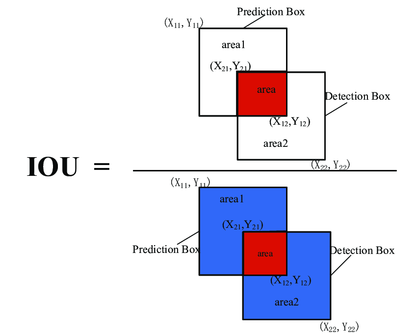

## 1. Object Detection

### (1) Metrics

#### Intersection over Union

> 모델이 Bounding Box를 얼마나 정확하게 판별했는지를 평가하기 위한 Metric
 - Origin of coordinate is on top-left
 - Intersection 
    - top-left of Intersection: `X1` is max of (box1[0], box2[0]), `Y1` is max of (box1[1], box2[1])
    - bottom-right of Intersection: `X2` is min of (box1[2], box2[2]), `Y2` is min of (box1[3], box2[3])
 - Union
    - Area_A + Area_B - Intersection
 - `0.5`: "decent", `0.7`: "prettey good", `0.9`: "almost perfect"

#### Non Max Suppression
> Clean up bounding boxes -> 하나의 대상에 대해서도 multiple bbox를 예측할 수 있기 때문에 겹치는 bbox를 NMS를 통해 삭제한다.
 - (Perhpas start with discarding all bounding boxes < probability threshold[0.2]) -> 하지만 mAP의 기준에서는 많이 있는게 오히려 더 좋다.
 - 먼저 Probability(Confidence) Score가 가장 높은 BBox를 기준으로 삼는다.
 - 그리고 Class가 같은 다른 BBox와 IoU를 계산해서, 일정 기준을 넘어가면 해당 BBox를 제외한다
 - 이후에 다음 Probability Score가 높은 BBox를 기준으로 다시 같은 과정을 반복한다.
 - 마지막으로 모든 Class에 대해서 위의 과정을 반복한다.

