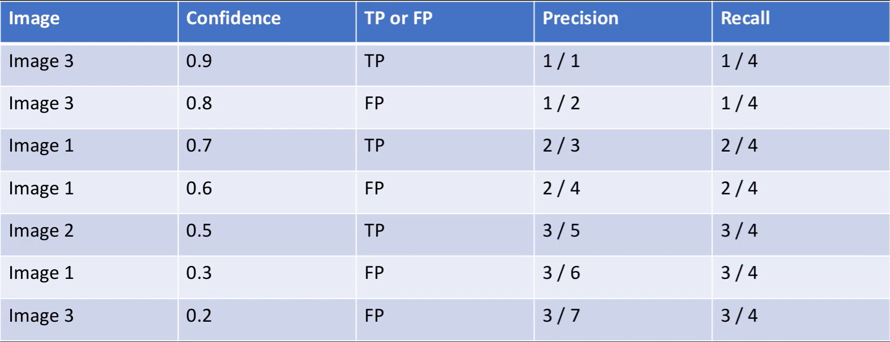
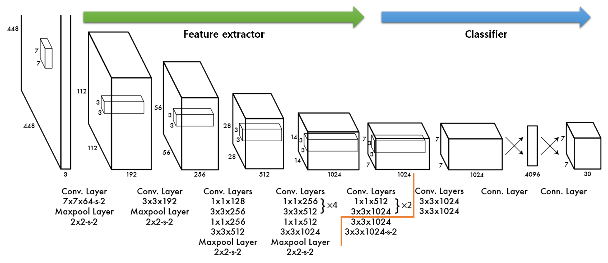
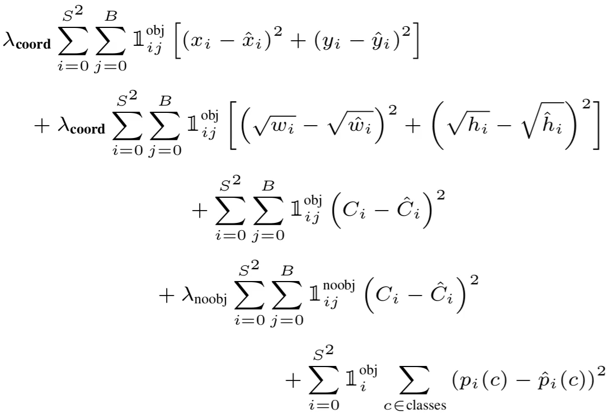

## 1. Classification

### (1) Vision Transformer

1. Transformer의 구조를 거의 변경하지 않고 Image Dataset을 이용해서 pre-train 시키고 Fine Tuning을 진행
2. 각 이미지를 patch로 나눠서 `patch embedding` + `1D position embedding`
3. Transformer 구조는 CNN이 내재하는 이미지에 특화된 Inductive Bias를 모델 구조적으로 가지지 못하지만, **충분히 큰 데이터셋을 이용해서 pre-train 진행 시 해당 한계를 이겨내고 SOTA와 비슷하거나 뛰어넘는 성능을 보여줌**

## 2. Object Detection

### (1) Metrics

#### Intersection over Union

> 모델이 Bounding Box를 얼마나 정확하게 판별했는지를 평가하기 위한 Metric
 - Origin of coordinate is on top-left
 - Intersection 
    - top-left of Intersection: `X1` is max of (box1[0], box2[0]), `Y1` is max of (box1[1], box2[1])
    - bottom-right of Intersection: `X2` is min of (box1[2], box2[2]), `Y2` is min of (box1[3], box2[3])
 - Union
    - Area_A + Area_B - Intersection
 - `0.5`: "decent", `0.7`: "prettey good", `0.9`: "almost perfect"

#### Non Max Suppression
> Clean up bounding boxes -> 하나의 대상에 대해서도 multiple bbox를 예측할 수 있기 때문에 겹치는 bbox를 NMS를 통해 삭제한다.
 - (Perhpas start with discarding all bounding boxes < probability threshold[0.2]) -> 하지만 mAP의 기준에서는 많이 있는게 오히려 더 좋다.
 - 먼저 Probability(Confidence) Score가 가장 높은 BBox를 기준으로 삼는다.
 - 그리고 Class가 같은 다른 BBox와 IoU를 계산해서, 일정 기준을 넘어가면 해당 BBox를 제외한다
 - 이후에 다음 Probability Score가 높은 BBox를 기준으로 다시 같은 과정을 반복한다.
 - 마지막으로 모든 Class에 대해서 위의 과정을 반복한다.

#### Mean Average Precision

> Clean up bounding boxes -> 하나의 대상에 대해서도 multiple bbox를 예측할 수 있기 때문에 겹치는 bbox를 NMS를 통해 삭제한다.

1. Get all bounding box predictions on our test set
2. Ground Truth와 IoU를 계산하여, Threshold를 기준으로 prediction box가 True Positive인지 False Positive인지 체크
3. Sort by descending confidence score
4. Calculate Precision & Recall one by one in order of sorted boxes

5. Calculate Area under PR Curve
6. Calculate for all classes then get mean value of all classes AP
7. `mAP@0.5:0.05:0.95` -> 0.5, 0.55, 0.6, ..., 0.95를 threshold로 둬서 mAP를 계산한 다음 모든 mAP를 다시 평균을 낸다는 의미

### (2) YOLO v1

> Image를 SxS Grid로 나눠서 Classification과 BBox Regression을 동시에 진행

 - Trained on `PASCAL VOC(Visual Object Class)` -> 최근에는 `COCOdataset`으로 대부분 진행
 - Idea of YOLO
   - Split into SxS Grid
   - Each cell will output a prediction with a corresponding bounding box
   - Each output and label will be relative to the cell -> `Midpoint` format(xywh)
   - 각 Cell을 1의 길이를 갖는 Box라고 생각해서 x,y는 0~1사이의 값을 갖는다. 단 object가 cell의 범위보다 더 커질 수도 있으므로 w,h는 더 클 수도 있다.
 - Label_cell
   - [C1, C2, ..., C20, Pc1, X, Y, W, H, Pc2, X, Y, W, H]
   - Predictions will look very similar, but we will output two bounding boxes
   - Classes + Probability that there is an object + 2-Bounding box
 - Note: a cell can only detect one object

- `part1`: 각각의 ground truth box와 IoU가 가장 높은 prediction(responsible 한 prediction)에 대해서 coordinate loss를 계산
- `part2`: 각각의 cell에 object가 있는지 없는지를 학습 (단 없는 경우가 대부분이기 때문에 regularization을 준다)
- `part3`: class 확률 학습
