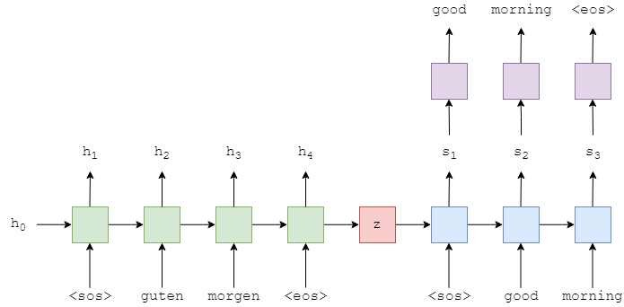

# Pytorch Tutorials

with resource

- [https://github.com/bentrevett]
- [https://www.youtube.com/channel/UCkzW5JSFwvKRjXABI-UTAkQ]

## 1. NLP Basic Models

### (1) Seq2Seq
> Encoder와 Decoder를 따로 만들어서, 입력으로 주어진 정보를 hidden & cell state에 잘 학습시킨 다음 Decoder에 전달해서 해석에 사용
 - Encoder & Decoder with LSTM
 - Neural Machine Translation
 - Embedding token to hidden state dim
 - Teacher Forcing

### (2) Seq2Seq with Attention
> Seq2Seq의 Encoder와 Decoder를 통해 학습을 할 때, 입력 Sequence의 길이가 길어지면 Deocder로 전달하는 Hidden & Cell state에서 병목현상이 일어날 수 밖에 없다. 또한 Gradient가 첫번째 Layer까지 도달하기 어려운 문제 (Long Term Dependency)를 해결하기 위해 Attention 구조를 사용
 - Encoder & Decoder with LSTM + Attention Layer
 - Use all hidden states in Encoder for caculate simialarity with Deocder's each hidden state
 - Solve Long Term Dependency problem -> More shoter way for gradient to get in encoder
 - Neural Machine Translation
 - Teacher Forcing
